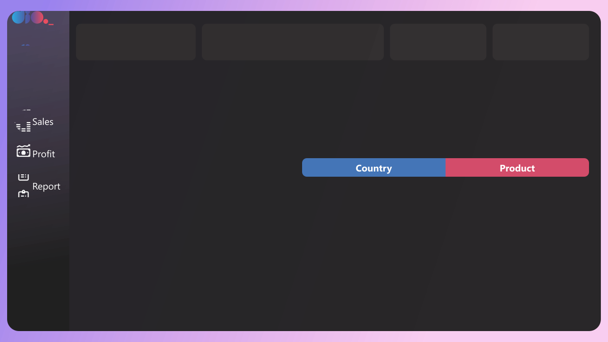
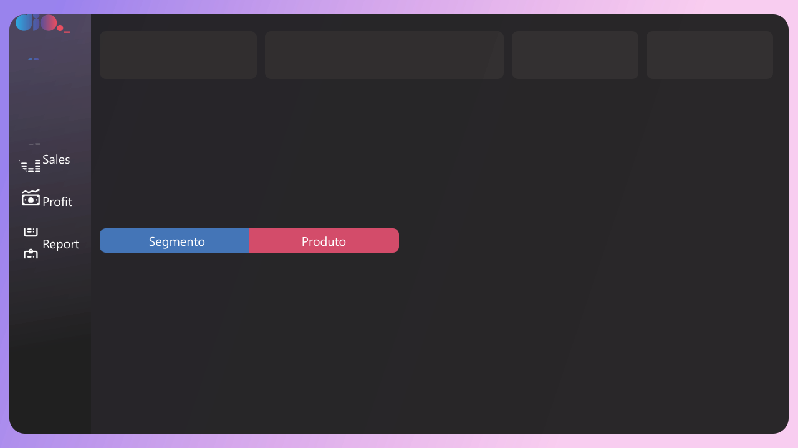
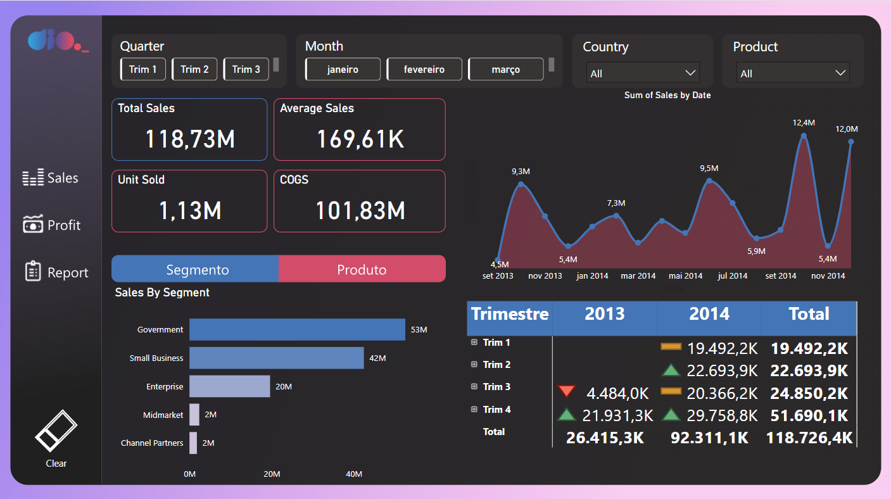
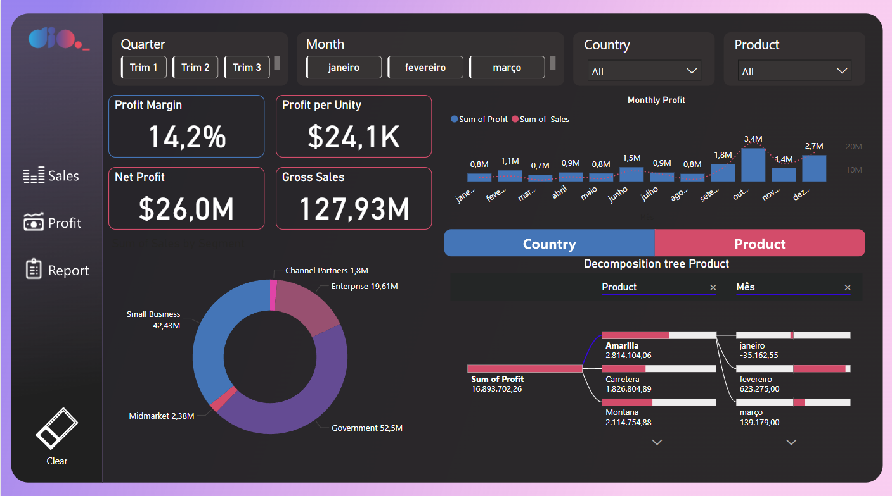
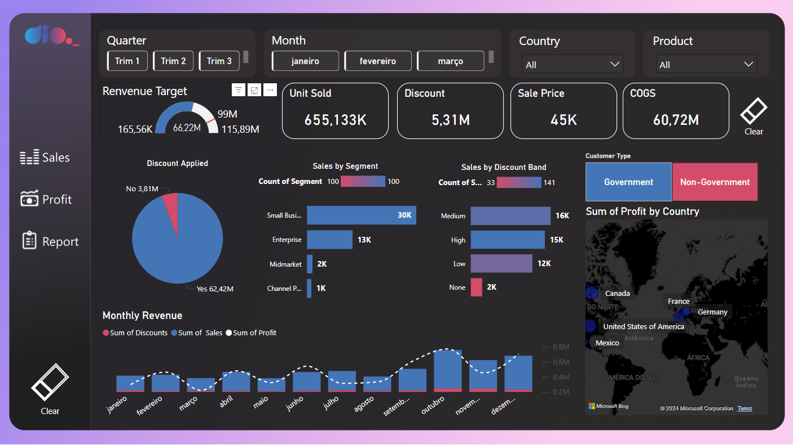

# Criando um Dashboard Gerencial para Tomada de Decisões com Power BI

Este projeto visa criar um dashboard gerencial no Power BI para apoiar a tomada de decisões empresariais. Ele abrange desde a criação de templates visuais no Figma até a implementação de métricas e KPIs utilizando DAX para análise de vendas, lucros e relatórios financeiros.

## Índice
1. [Criação de Templates com Figma](#1-criação-de-templates-com-figma)
2. [Relatório de Vendas (Sales)](#2-relatório-de-vendas-sales)
3. [Relatório de Lucro (Profit)](#3-relatório-de-lucro-profit)
4. [Relatório Sales Report](#4-relatório-sales-report)
5. [Criação de Colunas Calculadas com DAX](#5-criação-de-colunas-calculadas-com-dax)

---

## 1. Criação de Templates com Figma
Os templates visuais foram criados utilizando a ferramenta **Figma** para padronizar a aparência dos relatórios no Power BI, facilitando a apresentação de informações. Abaixo estão os templates utilizados:





---

## 2. Relatório de Vendas (Sales)
Este relatório fornece uma visão detalhada sobre o desempenho de vendas, segmentando dados por produto, região e outros parâmetros relevantes para análise. O objetivo é oferecer insights sobre quais produtos estão gerando mais receita e quais regiões estão se destacando.



---

## 3. Relatório de Lucro (Profit)
O relatório de **Profit** foca na análise do faturamento e dos lucros. Ele permite que a empresa compreenda melhor a rentabilidade de seus produtos e regiões. As métricas são calculadas considerando custos como o preço de fabricação e o COGS (Cost of Goods Sold).



---

## 4. Relatório Sales Report
Este relatório é voltado para análises mais amplas, incluindo **métricas financeiras** e **análises geográficas**. Ele mostra como diferentes regiões estão contribuindo para o desempenho da empresa e oferece uma visão detalhada de indicadores financeiros importantes.



---

## 5. Criação de Colunas Calculadas com DAX
Foram criadas várias colunas calculadas utilizando **DAX (Data Analysis Expressions)** no Power BI. Essas colunas oferecem insights financeiros como lucro líquido, margem de lucro e indicadores de desempenho, além de permitir a segmentação de dados por tipo de cliente e aplicação de descontos.

### Fórmulas DAX utilizadas:

```sql 
    lucro_liq = SUM(financials[Gross Sales]) - SUM(financials[Manufacturing Price]) - SUM(financials[COGS])
    -- Calcula o lucro líquido subtraindo o preço de fabricação e o COGS das vendas brutas

    max_sales = SUM(financials[Sales]) * 1.75
    -- Estima a venda máxima multiplicando as vendas totais por 1,75

    profit_margin = SUM(financials[Profit]) / SUM(financials[Sales])
    -- Calcula a margem de lucro dividindo o lucro total pelas vendas

    target = [max_sales] * 0.85
    -- Define uma meta de vendas como 85% do valor máximo de vendas

    total_profit = SUM(financials[Gross Sales]) - (SUM(financials[Manufacturing Price]) + SUM(financials[COGS]))
    -- Calcula o lucro total subtraindo os custos das vendas brutas

    Profit per Unity = DIVIDE([Profit], [Units Sold], 0)
    -- Calcula o lucro por unidade vendida

    Customer Type = IF(financials[Segment] = "Government", "Government", "Non-Government")
    -- Classifica os clientes como governamentais ou não governamentais

    Discount Applied = IF(financials[Discount Band] <> "None", "Yes", "No")
    -- Verifica se um desconto foi aplicado e retorna "Sim" ou "Não"
