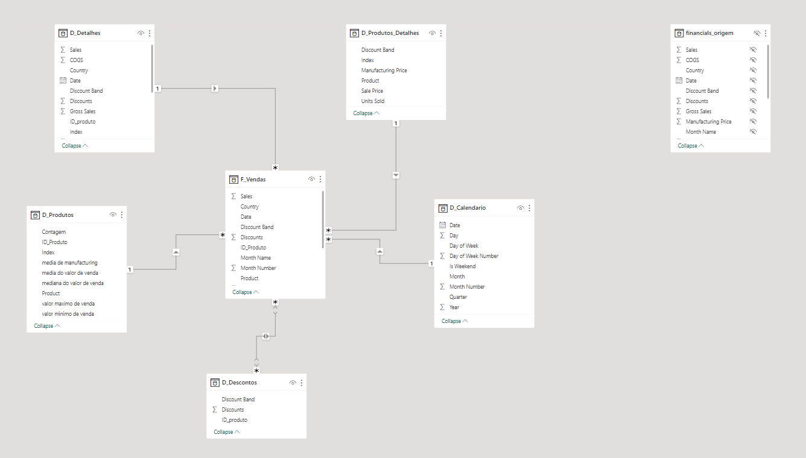
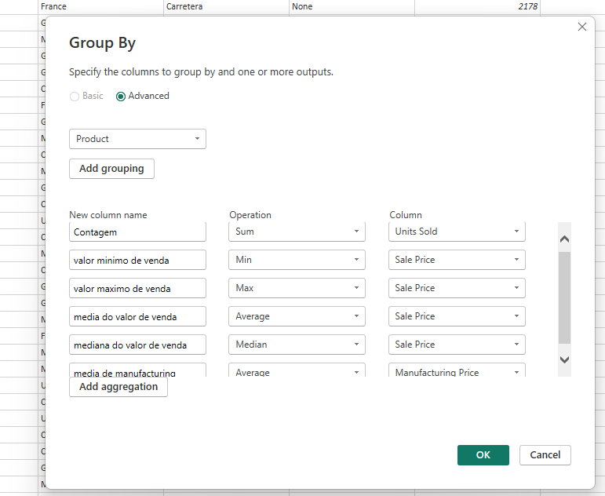

# Projeto de Modelagem de Dados - Power BI

## Descrição do Projeto

Este projeto consiste na criação de um modelo de dados baseado em um esquema estrela (star schema) utilizando uma tabela de dados financeiros. O objetivo é organizar e estruturar os dados de forma eficiente para análise e relatórios no Power BI.

## Estrutura do Projeto

### Tabelas Dimensão e Fato

As seguintes tabelas foram criadas no Power BI para compor o modelo de dados:

1. **D_Produtos**
   - **Colunas**: ID_produto, Produto, Média de Unidades Vendidas, Médias do valor de vendas, Mediana do valor de vendas, Valor máximo de Venda, Valor mínimo de Venda

2. **D_Produtos_Detalhes**
   - **Colunas**: ID_produtos, Discount Band, Sale Price, Units Sold, Manufactoring Price

3. **D_Descontos**
   - **Colunas**: ID_produto, Discount, Discount Band

4. **D_Detalhes**
   - Contém informações adicionais e detalhadas sobre as vendas.

5. **F_Vendas**
   - **Colunas**: SK_ID, ID_Produto, Produto, Units Sold, Sales Price, Discount Band, Segment, Country, Salers, Profit, Date

6. **D_Calendário**
   - **Colunas**: Date, Day, Month, Month_number, Quarter, Year, Day of Week, Day of Week Number, Is Weekend
   

## Processo de Criação do Modelo

1. **Importação dos Dados**:
   - A tabela "Financial Sample.xlsx"  foi importada para o Power BI.

2. **Criação das Tabelas Dimensão e Fato**:
   - As tabelas dimensão e fato foram criadas com base na tabela original, selecionando e organizando as colunas relevantes.

3. **Criação da Tabela de Calendário**:
   - Utilizando a função DAX `CALENDAR()`, foi criada uma tabela de calendário para permitir análises temporais.

4. **Relacionamentos**:
   - Estabelecido relacionamentos entre as tabelas de forma a criar um modelo estrela que facilite a análise dos dados.

## Captura do Esquema Estrela

Um diagrama do esquema estrela foi capturado e incluído neste repositório para visualização do modelo de dados.



## Funcionalidades e Funções DAX Utilizadas

- **CALENDAR()**: Função utilizada para criar a tabela de calendário.

```SQL
    
    D_Calendario = 
        VAR MinDate = MIN('F_Vendas'[Date])
        VAR MaxDate = MAX('F_Vendas'[Date])
        RETURN
            ADDCOLUMNS (
                CALENDAR(MinDate, MaxDate),
                "Day", DAY([Date]),
                "Month", FORMAT([Date], "MMMM"),
                "Month Number", MONTH([Date]),
                "Quarter", "Q" & QUARTER([Date]),
                "Year", YEAR([Date]),
                "Day of Week", FORMAT([Date], "dddd"),
                "Day of Week Number", WEEKDAY([Date]),
                "Is Weekend", IF(WEEKDAY([Date], 2) > 5, TRUE(), FALSE())
            )


   ```

- **Outras Funções**: Funções adicionais foram utilizadas para calcular métricas como média, mediana e valores máximos e mínimos.
- 

## Instruções de Uso

1. **Abrir o Arquivo Power BI**:
   - O arquivo `.pbix` pode ser aberto com o Power BI Desktop para visualização e manipulação do modelo de dados.

2. **Explorar o Modelo**:
   - Navegue pela visualização do modelo para entender os relacionamentos e a estrutura das tabelas.

3. **Analisar Dados**:
   - Utilize o modelo para criar relatórios e dashboards que ajudem na análise dos dados financeiros.

## Conclusão

Este projeto demonstra a criação de um modelo de dados eficiente utilizando Power BI, com foco em uma estrutura de esquema estrela para facilitar a análise de dados financeiros.

## Links

- [Repositório do Bootcamp](https://github.com/hugomilesi/BOOTCAMP-DIO-NTT-DATA---Engenharia-de-Dados-com-Python)
