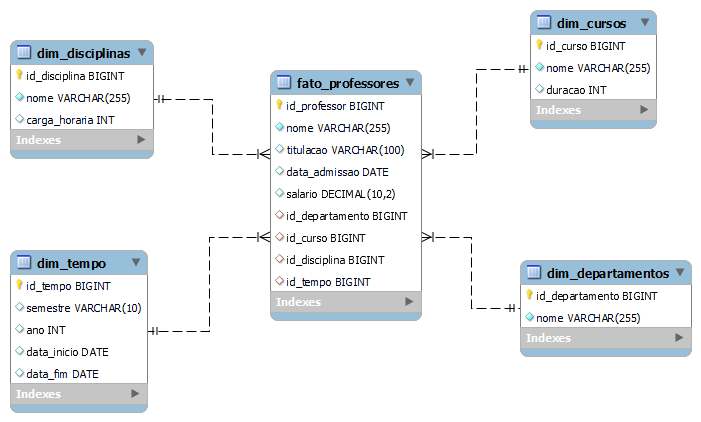

# Objetivo

O objetivo deste desafio é criar um **diagrama dimensional** utilizando o **modelo Star Schema** com foco na análise dos dados dos professores. O diagrama deve ser baseado no modelo relacional existente, que já contém informações detalhadas sobre os professores, departamentos, cursos, disciplinas, entre outros.

O foco principal é **o professor** como objeto de análise. A tabela fato deve refletir diversos aspectos relacionados aos professores, como cursos ministrados, o departamento ao qual pertencem, disciplinas oferecidas, e outras associações relevantes.

---

# Diagrama Relacional

## Metadados das Tabelas

**Professores**: Armazena dados pessoais e financeiros dos professores.

**Departamentos**: Contém informações sobre os departamentos da escola, incluindo o chefe de cada departamento.

**Cursos**: Guarda detalhes dos cursos oferecidos, como duração e o departamento responsável.

**Disciplinas**: Detalha as disciplinas, incluindo carga horária e o curso ao qual estão associadas.

**OfertasDisciplinas**: Registra as disciplinas oferecidas por professores em períodos específicos.

**Alunos**: Contém informações sobre os alunos, como nome, matrícula e o curso em que estão matriculados.

**MatriculasDisciplinas**: Armazena dados sobre a matrícula dos alunos em disciplinas específicas e suas notas finais.

**Avaliacoes**: Guarda informações sobre as avaliações feitas pelos alunos nas disciplinas.

**Turmas**: Contém dados sobre as turmas, que estão associadas a cursos específicos.

**Horários**: Armazena os horários das disciplinas nas turmas, incluindo dias da semana e horários de aula.

---

# Diagrama do Star Schema

## Estrutura do Star Schema

### Tabela Fato

**Fato_Professores**:
- Armazena informações detalhadas sobre os professores.
- Contém chaves estrangeiras que se relacionam com as tabelas de dimensões.

 ---
 
### Tabelas de Dimensões

**Dim_Departamentos**:
- Contém informações detalhadas sobre os departamentos da escola.

**Dim_Cursos**:
- Armazena dados sobre os cursos oferecidos pela escola.

**Dim_Disciplinas**:
- Contém informações sobre as disciplinas, como carga horária e curso associado.

**Dim_Tempo**:
- Armazena informações temporais relevantes para as análises relacionadas aos professores.

---

## Benefícios do Star Schema

- **Simplicidade**: O modelo Star Schema é mais simples de entender e utilizar, facilitando o design e a manutenção do banco de dados.
  
- **Desempenho**: Esse modelo otimiza o desempenho das consultas e relatórios, permitindo análises rápidas sobre professores e suas associações com departamentos, cursos e disciplinas.
  
- **Flexibilidade**: Oferece uma estrutura flexível para análises detalhadas e cruzadas, permitindo explorar relações entre professores e as diferentes dimensões associadas.

---
